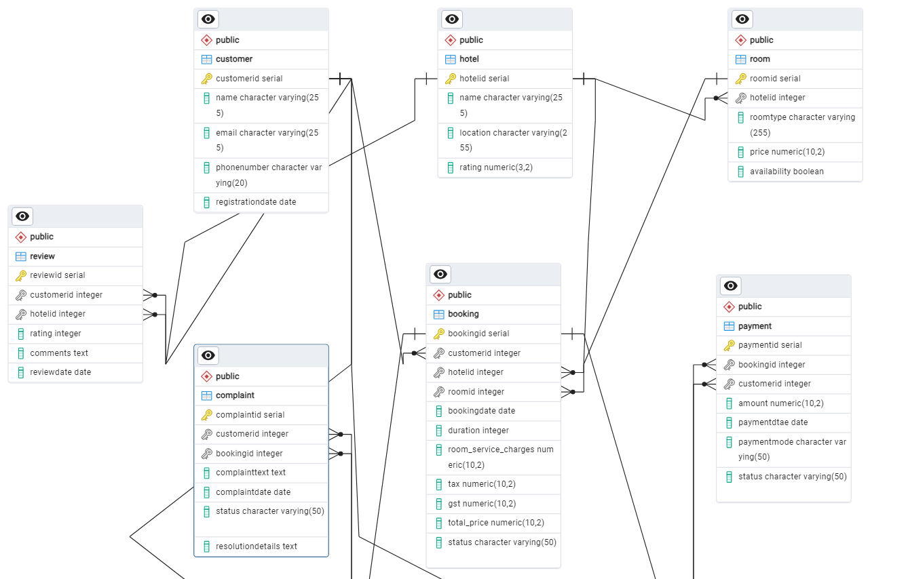

<h1>Product Dissection on OYO</h1>

<h2>Project Overview</h2>

This project is a comprehensive dissection of the product architecture of OYO, focusing on analyzing and mapping the relationships between different entities within the system. The database design is built using <strong>PostgreSQL</strong>, and it includes various entities such as customers, bookings, hotels, rooms, payments, complaints/queries, and reviews.

<h2>Key Features</h2>
<ul>
  <li><strong>Database Design</strong>: The project utilizes PostgreSQL to design and manage a relational database structure.</li>
  <li><strong>Entity Relationships</strong>: Key relationships between customers, bookings, hotels, rooms, payments, and reviews are mapped.</li>
  <li><strong>Efficient Data Management</strong>: The database efficiently handles complex queries and relationships across multiple entities.</li>
</ul>

<h2>Database Tables</h2>

The following tables are part of the database schema:

<ul>
  <li>Customer</li>
  <li>Booking</li>
  <li>Hotel</li>
  <li>Room</li>
  <li>Payment</li>
  <li>Complaint/Query</li>
  <li>Review</li>
</ul>

<h2>Entity-Relationship Diagram (ERD)</h2>

The ERD diagram provides a visual representation of the relationships between the entities:

<h2>How to Use</h2>
<ol>
  <li>Clone the repository:</li>
  <pre><code>git clone https://github.com/yourusername/oyo-product-dissection.git</code></pre>
  <li>Set up PostgreSQL and import the database schema provided in the repository.</li>
  <li>Run queries or modify the database as needed.</li>
</ol>

<h2>Tech Stack</h2>
<ul>
  <li><strong>PostgreSQL</strong>: For database management and querying.</li>
  <li><strong>Python/SQL</strong>: For data manipulation and analysis.</li>
</ul>

<h2>Project Documentation</h2>

For detailed project documentation, check out the link below:

<strong>Project Documentation</strong>: <a href="Insert Documentation Link Here">View Documentation</a>

